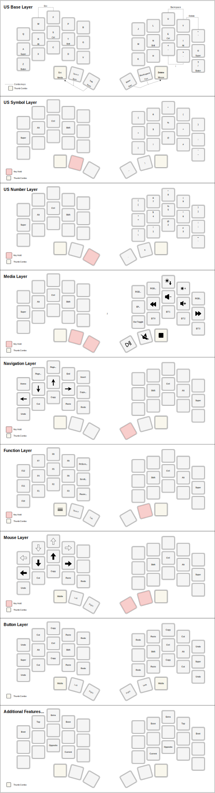
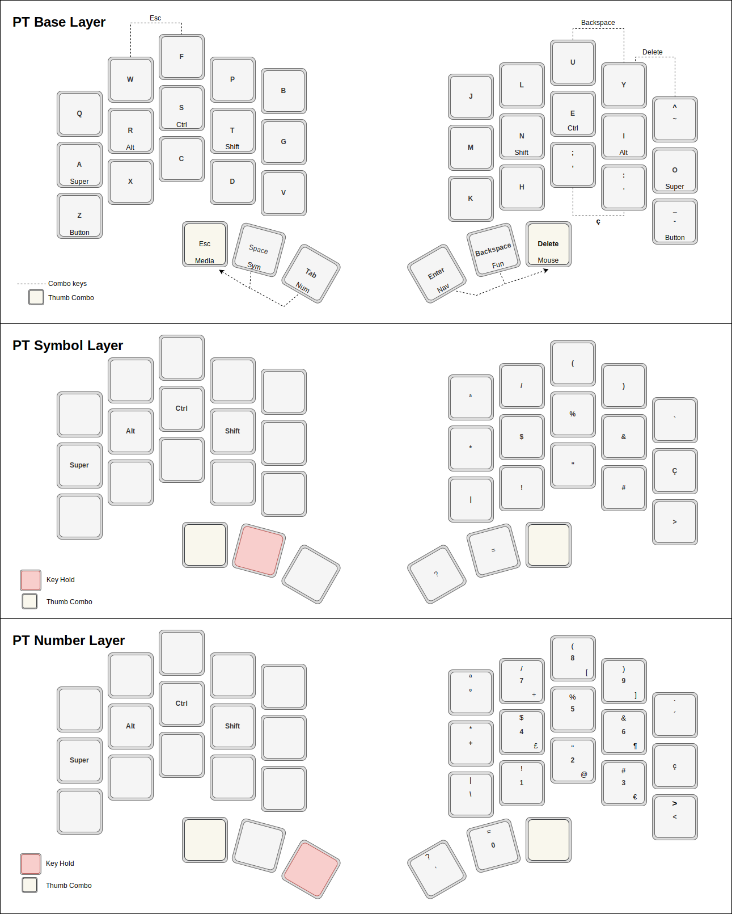

I forked the [Miryoku ZMK](https://github.com/manna-harbour/miryoku_zmk)
added the [build-sweep-nice_nano_v2.yml](.github/workflows/build-sweep-nice_nano_v2.yml) build and a [custom_config.h](miryoku/custom_config.h). To be able to have custom combos, I added [custom_combos.dtsi](miryoku/custom_combos.dtsi). The end result is the following layout:

  

Portuese Layout:

  

The explanation of how everything works can be found [here](https://github.com/manna-harbour/miryoku/tree/master/docs/reference).
